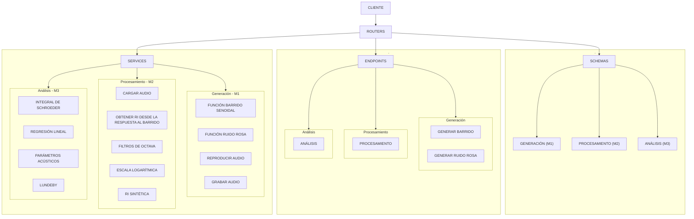

# RIR-API

API REST para procesamiento y análisis de respuestas al impulso según la norma ISO 3382.

<!-- Badges -->


## Descripción

RIR-API es una API RESTful desarrollada en Python utilizando el framework **FastAPI**. Su objetivo principal es el cálculo de parámetros acústicos (EDT, T20, T30, T60, D50, C80) de salas a partir de Respuestas al Impulso (RI), siguiendo los lineamientos de la norma internacional ISO 3382-1.

## Integrantes del equipo
* Mora Sawczyk - Legajo 79832
* Matias Moreira - Legajo 29222
* Francisco Gil Frias - Legajo 50070

Todos los integranes participaron tanto en el diseño, implementación del código, testing, como en la documentación del proyecto.

## Branching strategy 
Para el presente proyecto se adopta una estrategia de ramas en la cual el desarrollo se integra principalmente en la rama develop, que actúa como entorno de integración y pruebas. Esta rama concentra las modificaciones de las distintas funcionalidades en desarrollo, permitiendo su validación conjunta antes de ser incorporadas a producción.
La rama main se reserva exclusivamente para versiones estables y listas para despliegue en entorno productivo.

A partir de `develop` se crean ramas de trabajo según la tarea a realizar. La mayoría corresponden a ramas de tipo `feature/*`, destinadas al desarrollo de funcionalidades específicas asociadas a los distintos *milestones* del proyecto. Además, se utilizaron ramas específicas para la integración de **FastAPI**, la incorporación y actualización de la **documentación**, y la realización de **correcciones y refactorizaciones** del código.

Cada rama se desarrolla de forma aislada y, una vez finalizada y validada, se integra nuevamente a `develop` mediante un *pull request*, permitiendo revisar los cambios antes de su incorporación.

## Requisitos previos

- Python 3.12 o superior
- [uv](https://docs.astral.sh/uv/) (gestor de paquetes y entornos virtuales)
- [git](https://git-scm.com/install) (herramienta para controlar versiones de código)

## Instalación 

```bash
# Clonar el repositorio
git clone https://github.com/frangilfrias/Signals-systems-gil-frias.git
cd RIR_API

# Crear entorno virtual e instalar dependencias
uv venv
uv pip install -e ".[dev]"
```

## Ejecución

Para ejecutar la API utilizando el entorno virtual creado con `uv`, se recomienda utilizar `uv run`:

```bash
# Iniciar la API con hot-reload
uv run uvicorn app.main:app --reload

# O usando el modulo directamente
uv run python -m app.main
```

Una vez iniciada, la API estará disponible en: 
- `http://127.0.0.1:8000` 

La documentación interactiva puede  consultarse en:
- **Swagger UI:** <http://127.0.0.1:8000/docs>
- **ReDoc:** <http://127.0.0.1:8000/redoc>

## Estructura del proyecto

```
RIR_API/
├── app/
│   ├── __init__.py
│   ├── main.py                    # Punto de entrada FastAPI
│   ├── routers/
│   │   ├── health.py              # GET /health
│   │   ├── acoustics.py           # Cálculo de parámetros acústicos
│   │   ├── analysis.py            # Análisis de respuestas al impulso
│   │   ├── filters.py             # Filtrado y procesamiento de señales
│   │   ├── signals.py             # Generación de señales de excitación
│   │   ├── utils.py               # Funciones auxiliares de procesamiento
│   │   └── __init__.py 
│   ├── schemas/
│   │   └── __init__.py            # Modelos Pydantic de request/response
│   └── services/
|       ├── __init__.py 
│       ├── pink_noise.py          # Generacion de ruido rosa (M1)
│       ├── sine_sweep.py          # Generacion de sine sweep (M1)
│       ├── signal_utils.py        # Utilidades de procesamiento (M2)
│       ├── filter.py              # Filtros de banda de octava (M2)
│       ├── acoustic_parameters.py # Parametros acusticos ISO 3382 (M3)
│       └── reproducir_grabar.py   # Grabación y reproducción (M2)
├── tests/
│   ├── test_generacion.py         # Tests de generacion (M1)
│   ├── test_procesamiento.py      # Tests de procesamiento (M2)
│   ├── test_analisis.py           # Tests de analisis (M3)
│   ├── test_api.py                # Tests de endpoints (M3)
│   └── test_reproducir_grabar.py  # Tests de reproducir grabar (M2)
├── docs/                          # Documentación de cada Milestone
│   ├── 
├── .github/workflows/
│   └── ci.yml                     # Integracion continua
├── pyproject.toml                 # Configuracion del proyecto
├── uv.lock
└── README.md
```

## Diagrama de arquitectura

## Funcionalidades

La API permite:

- Generar ruido rosa.
- Generar barridos senoidales.
- Reproducir y grabar audio.
- Obtener la respuesta al impulso.
- Filtrar por bandas de octava.
- Calcular EDT, T20, T30, T60, D50 y C80.
- Acceder a todas las funcionalidades mediante una API REST documentada con Swagger.
## Milestones

El proyecto se desarrolló en cuatro *milestones*, cada uno enfocado en un conjunto de funcionalidades. A continuación se describen las tareas realizadas en cada etapa.

#### M0 — Setup del entorno

En este milestone se preparó la infraestructura inicial del proyecto. Se configuró el entorno de desarrollo utilizando `uv`, se creó la estructura base de la API con FastAPI, se incorporó el endpoint `/health` para verificar el funcionamiento del servicio y se configuró la integración continua (CI) mediante GitHub Actions.

#### M1 — Generación de señales

En esta etapa se desarrollaron las funcionalidades de generación de señales, implementando los algoritmos de generación de ruido rosa y barrido senoidal (`sine sweep`), junto con el módulo de reproducción y grabación de audio. Estas implementaciones se realizaron en `app/services/` y fueron validadas mediante los tests correspondientes.

#### M2 — Procesamiento de señales

En este milestone se implementaron las herramientas de procesamiento de señales, incluyendo la carga de archivos de audio, la obtención de la respuesta al impulso a partir de un barrido senoidal, el filtrado por bandas de octava, la conversión a escala logarítmica y la síntesis de respuestas al impulso para validación. Todas estas funcionalidades se desarrollaron en `app/services/` y fueron verificadas mediante pruebas unitarias.

#### M3 — API REST y análisis de parámetros acústicos

Durante este milestone se desarrollaron los algoritmos para el cálculo de parámetros acústicos, incluyendo la integral de Schroeder, la regresión lineal y el cálculo automático de los distintos parámetros. Además, se integraron todas las funcionalidades dentro de una API REST mediante FastAPI, incorporando los routers, esquemas de validación y la documentación automática de la API.

## Ejecución de los tests

```bash
# Ejecutar todos los tests
uv run pytest -v

# Ejecutar tests de un modulo especifico
uv run pytest tests/test_generacion.py -v

# Ejecutar tests de la API
uv run pytest tests/test_api.py -v

# Ejecutar tests con reporte de cobertura
uv run pytest --tb=short
```

## Verificación del linter

```bash
# Verificar estilo de codigo
uv run ruff check app/ tests/

# Corregir automaticamente lo que se pueda
uv run ruff check --fix app/ tests/

# Formatear el codigo
uv run ruff format app/ tests/
```

## Licencia

Este proyecto está licenciado bajo la Licencia MIT. Ver el archivo `LICENSE` para más detalles.
