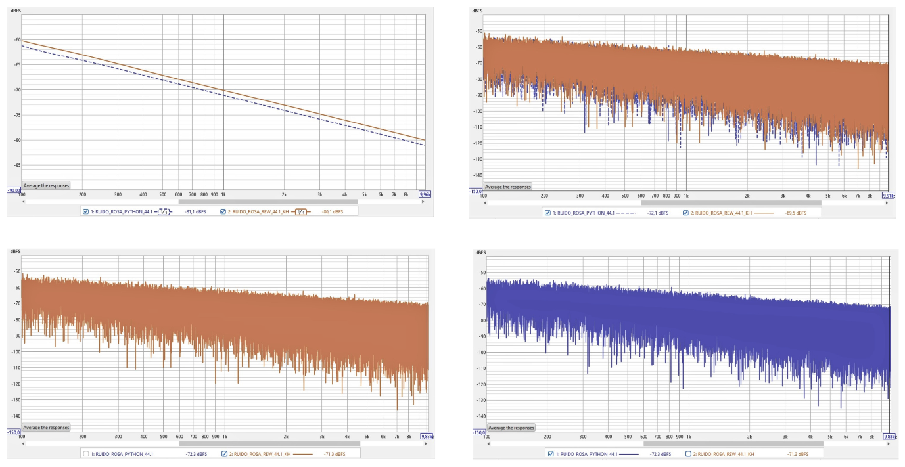

# Documentacion de RIR-API

## Estructura

Este directorio contiene la documentacion del proyecto. Se recomienda organizar los
archivos de la siguiente manera:

```
docs/
├── README.md              # Este archivo
├── teoria/                # Notas teoricas y referencias
│   ├── iso_3382.md        # Resumen de la norma ISO 3382
│   └── parametros.md      # Explicacion de EDT, T20, T30
├── mediciones/            # Reportes de mediciones realizadas
│   └── sala_ejemplo.md    # Informe de una medicion
└── imagenes/              # Graficos y diagramas generados
```

## API de referencia

Explorar la [documentacion interactiva de la API de la catedra](https://rir-api.onrender.com/docs)
para entender la estructura de endpoints, schemas y respuestas esperadas.

## Referencias utiles

- **ISO 3382-1:2009** — Acoustics — Measurement of room acoustic parameters.
- Farina, A. (2000). *Simultaneous measurement of impulse response and distortion
  with a swept-sine technique.*
- Schroeder, M. R. (1965). *New method of measuring reverberation time.*
  The Journal of the Acoustical Society of America.
- Lundeby, A. et al. (1995). *Uncertainties of measurements in room acoustics.*
  Acta Acustica.
- [FastAPI: documentacion oficial](https://fastapi.tiangolo.com/)
- [Pydantic: validacion de datos](https://docs.pydantic.dev/)

## Notas

Cada milestone deberia documentarse brevemente en este directorio, incluyendo:

1. Decisiones de diseno tomadas.
2. Resultados de validacion (graficos, tablas comparativas).
  ## Generación
## Ruido rosa

### I.1 Aspectos generales

Se validó manualmente la función de generación de ruido rosa mediante dos métodos:

a. Inspección visual.  
b. Comparación con una señal de ruido rosa de referencia.

---

### I.2 Origen y formato de los archivos de audio

El archivo de audio asociado al código desarrollado en Python v 3.13.12, ha sido escrito mediante la función `write` de la librería `soundfile`, mientras que el archivo de referencia fue generado utilizando el software Room Eq Wizard Acoustics v 5.1.3(REW)

En ambos casos se utilizó el siguiente formato de audio digital:

- Frecuencia de muestreo:
  
  f_s = 44.1 kHz
  

- Profundidad de bits:
  
  N = 16 bits
  

- Codificación:
  PCM

---

### I.3 Procesamiento

Los archivos de audio fueron procesados mediante el software REW, obteniendo las correspondientes respuestas de amplitud.

Las respuestas fueron evaluadas:

- Sin suavizado
- Mediante suavizado por bandas de octava.

---

### I.4 Resultados

En la figura 1 se muestra la  respuesta de amplitud suavizada y sin suavizar de la señal generada a través de python mediante la función generar_ruido_rosa, y la de referencia obtenida desde el software REW.


*Figura 1. Respuestas en amplitud conjuntas: suavizadas (superior derecha) y sin suavizar (superior izquierda). Respuestas individuales: REW (inferior izquierda) y Python (inferior derecha).*
---

### I.5 Conclusiones

Se validó la señal de ruido rosa generada mediante la función `generar_ruido_rosa` desarrollada en Python.
3. Problemas encontrados y como se resolvieron.
