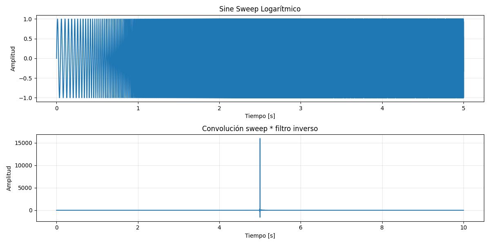
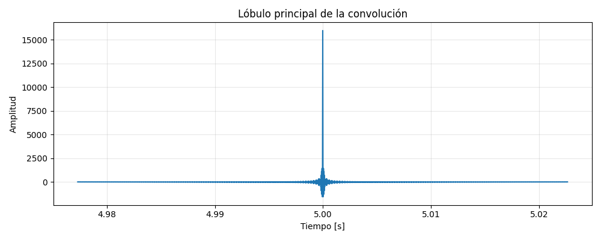

# Documentacion de RIR-API
## Reproducir/grabar

Para el correcto funcionamiento del código y el armado general de reproducir y grabar se pasaron por varios intentos previos al correcto funcionamiento del mismo. En un principio, en cuanto a las decisiones de diseño, se creo la branch play-record para realizar el código y luego mergearlo al main. 

Como primera medida, al armar el código se tuvo el incoveniente de no haber trabajado con el comando playrec, sino que se intentó trabajar por separado con play y rec. Dicha decisión se tornó en un incoveniente para luego trabajar con señales mono y estéreo ya que no permitían la correcta determinación de las mismas y también generaba incovenientes dentro del pytest. Debido a esto, con ayuda de la IA se determinó donde estaban los problemas y las cosas que faltaban para cumplir con la entrega del reproducir y grabar para M1. Se le brindaron a la IA las consideraciones técnicas que se debían cumplir y corrigió ítems puntuales y las respuestas fueron las siguientes: 

- Al no usar sd.playrec y trabajar con play/rec por separado eso no garantizaba sincronización real 
- No estaba bien definido el preroll entre 0.5-1seg, lo cual era clave para latencia y evitar el corte de inicio de la RI 
- No se estaba controlando la duración correctamente 
- Estaba todo el tiempo en MONO fijo, lo cuál si forzaba 1 canal rompía el estéreo
- No estaba correcta la validación de dispositivo 

También se le preguntó a la IA: "¿qué pasa con la validación de dispositivos si estamos probando con dispositivos mockeados?" a lo cual respondió mockear también *query_devices* visto y considerando que podría romper los test porque no hay un hardware real. Luego de las consultas, también se realizó en el código un mínimo script para que se pueda escuchar lo que se haya grabado para un correcto monitoreo de la situación. 

Con este listado de soluciones, trabajando en conjunto con la IA se realizaron las correcciones correspondientes dentro del código para luego realizar los respectivos test. Los tests unitarios utilizan mocks para simular el comportamiento de dispositivos de audio, permitiendo validar la lógica sin dependencia de hardware físico. Adicionalmente, para realizar una pequeña prueba, se armó dentro de *Services* un archivo llamado *prueba_reproducir_grabar.py* el cual le permite al usuario realizar una grabación (por su entrada y salida por defecto o eligiendo las mismas) con una cantidad determinada de segundos que luego se almacena dentro de *RIR_API* como un archivo .WAV. Dicha información de entrada y salida podrá ser consultada por el usuario a través de *uv run app/services/listar_dispositivos.py*. En caso de que el usuario decidiera cambiar su dispositivo de entrada y salida debe hacer lo siguiente dentro de *listar_dispositivos.py*: 

```bash
 # Visualización de dispositivos default 
import sounddevice as sd
print(sd.default.device)

# En caso de querer cambiar los dispositivos
import sounddevice as sd
print(sd.query_devices()) 
sd.default.device = (input_id, output_id) 
```

## Decisiones de diseno tomadas.
## Generación de ruido rosa
Se tomó la decisión de realizar el diseño a través  del método espectral (algoritmo sugerido en pink_noise.py) en lugar del de Voss McCartney, el cual se encuentra especificado en el issue #10.

## Resultados de validacion (graficos, tablas comparativas).
  ## Generación
### Ruido rosa

### I.1 Aspectos generales

Se validó manualmente la función de generación de ruido rosa mediante dos métodos:

a. Inspección visual.  
b. Comparación con una señal de ruido rosa de referencia.

---

### I.2 Origen y formato de los archivos de audio

El archivo de audio asociado al código desarrollado en Python v 3.13.12, ha sido escrito mediante la función `write` de la librería `soundfile`, mientras que el archivo de referencia fue generado utilizando el software Room Eq Wizard Acoustics v 5.1.3(REW)

En ambos casos se utilizó el siguiente formato de audio digital:

- Frecuencia de muestreo:
  
  f_s = 44.1 kHz
  

- Profundidad de bits:
  
  N = 16 bits
  

- Codificación:
  PCM

- Duración: 30.0 s

---

### I.3 Procesamiento

Los archivos de audio fueron procesados mediante el software REW, obteniendo las correspondientes respuestas de amplitud.

Las respuestas fueron evaluadas:

- Sin suavizado
- Mediante suavizado por bandas de octava.

---

### I.4 Resultados

En la figura 1 se muestra la  respuesta de amplitud suavizada y sin suavizar de la señal generada a través de python mediante la función generar_ruido_rosa, y la de referencia obtenida desde el software REW.


*Figura 1. Respuestas en amplitud conjuntas: suavizadas (superior derecha) y sin suavizar (superior izquierda). Respuestas individuales: REW (inferior izquierda) y Python (inferior derecha).*
---

### I.5 Análisis
- Por simple inspección visual de la figura 1, se observa la variación de -3 dB/octava de  la respuesta de amplitud de la señal de ruido rosa generada en lenguaje python.
- La señal obtenida mediante la implementación de la función generar_ruido_rosa presenta la misma densidad espectral de potencia que la señal de referencia.

### I.5 Conclusión
Se validó la señal de ruido rosa generada mediante la función `generar_ruido_rosa` desarrollada en Python v 3.13.12.

## Decisiones de diseño 
## Generación de Sine Sweep

El método para la generación del sine sweep fue dado por la fórmula matemática:

$$x(t) = \sin\left[\frac{2\pi f_1 T}{\ln(f_2/f_1)} \left(e^{t \ln(f_2/f_1)/T} - 1\right)\right]$$

Donde:
$f_1$ es la frecuencia inicial (Hz)
$f_2$ es la frecuencia final (Hz)
$T$ es la duracion total del sweep (s)
$t$ es el tiempo, con $0 \leq t \leq T$

Por lo tanto la señal generada tendrá crecimiento exponencial, lo que conlleva a que haya mayor cantidad de energía en las frecuencias cercanas a $f_1$ , esto se toma en cuenta al crear el filtro inverso.

Para generar el filtro inverso, se invirtió el sweep temporalmente y se corrigió la amplitud debido a la distribución no uniforme de la energía en el rango de frecuencias dado.

$$x_{inv}(t) = \frac{x(T - t)}{A(t)}$$

$$A(t) = e^{-t \ln(f_2/f_1)/T}$$

En la convolusión de la señal generada y el filtro inverso, se obtuvo un impulso con lóbulos al rededor del mismo con menor amplitud, energía. Este comportamiento valida el correcto funcionamiento  del algoritmo de generación y del proceso del filtrado.

Además, el código cuenta con validacio2n de datos de ingreso para que no haya ninguna ruptura en las funciones del mismo por valores no permitidos. Con respecto a la frecuencia de sampleo, se seleccionaron las frecuencias de: 44100 Hz, 48000 Hz, 88200 Hz, 96000 Hz, 176400 Hz, 192000, 352800 Hz, 384000 Hz, 705600 Hz, 768000 Hz , las cuales son las más utilizadas.

## Validación

Se validó manualmente la función de generación de sine sweep mediante dos métodos:

a. Inspección visual.
b. Comparación con una señal de sine sweep de referencia.

El barrido de frecuencias de referencia utilizado fue el generado por REW, con las características de:
- Barrido de 20 Hz a 20 KHz
- 5 segundos de duración
- Frecuencia de sampleo seteada a 44.1 KHz


## Resultados

Al graficar el sine sweep generado por nuestro algoritmo, pudimos verificar que cubre el rango de frecuencias especificado, presenta un barrido logarítmico continuo, con la distribución de energía no uniforme. Al convolucionar nuestra señal con el filtro inverso, la respuesta obtenida es una aproximación discreta del impulso de Dirac, es decir un pico temporal predominante acompañado de pequeños lóbulos




Al comparar la señal generada con la obtenida mediante el algoritmo comercial de referencia, puede observarse una distribución de energía espectral similar en todo el rango de frecuencias analizado.

 21.07.39.png)

## Problemas encontrados

Uno de los principales inconvenientes encontrados durante el desarrollo estuvo relacionado con la validación de parámetros de entrada y la implementación de los tests, ya que inicialmente varias pruebas no eran superadas correctamente por el código desarrollado.
Por lo tanto utilizamos la herramienta (chat gpt) y analizamos de manera crítica la solución brindada, en varias ocaciones se pidió que vuelva a formular el código debido a que no funcionaba de manera correcta.
Además se utilizó su ayuda para la generación de lo gráficos con sus descripciones.

