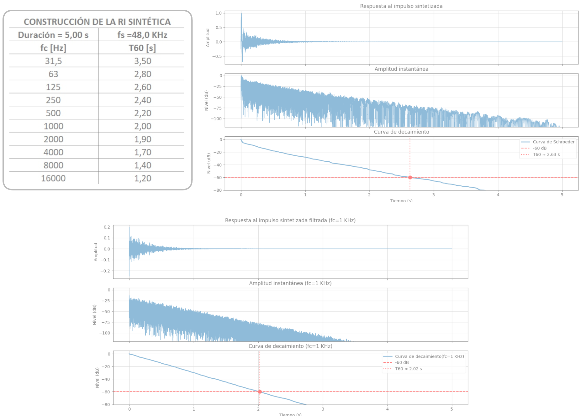
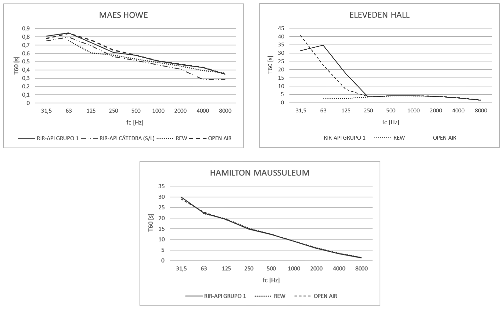

# Síntesis RI
- La síntesis RI está constituida por ruido blanco filtrado por bandas de octava con envolvente
exponencial abarcando las frecuencias centrales desde 31.5 Hz hasta 31.5 KHz, lo cual constituye una
emulación de la respuesta al impulso de un campo sonoro difuso.
- En la figura se muestra la síntesis descrita y su validación mediante el procesamiento con un filtro 
de octava normalizado según IEC 61260:2014.

# Filtros de octava
- Se encuentran diseñados de acorde a la norma IEC 61260:2014. El banco de filtros está formado por filtros
pasabanda butterwoth de cuarto orden, y su aplicación a la señal de entrada mediante el procesamiento
bidireccional (forward-backward) de manera de obtener una respuesta de fase igual a cero para la banda
de paso.
- La validación se observa en la siguiente figura en la cual se ha procesado la respuesta al impulso de
tres salas, para obtener el tiempo de reverberación. El procesamiento se ha realizado mediante dos
programas (REW acoustics y Precisión máxima) con el objetivo de comparar los datos obtenidos con
el código propuesto (Grupo 1). Por otra parte se han incluido los valores de T60 publicados en la fuente
desde la cual se han extraido los audios de las RI (https://www.openair.hosted.york.ac.uk/)

