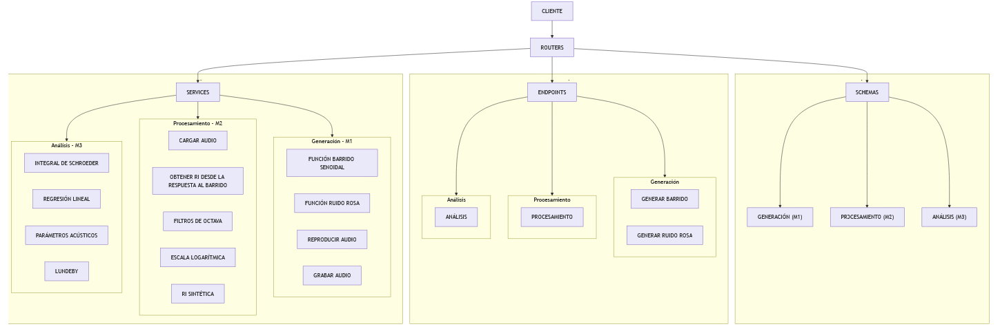

# Desarrollo de un software para el cálculo de parámetros acústicos según la norma ISO 3382-1

---

## Resumen

Este documento presenta el desarrollo de una API RESTful orientada al cálculo de parámetros acústicos según la norma ISO 3382-1. El software diseñado procesa la respuesta al impulso para la obtención de parámetros acústicos por bandas de octava, tanto a través de la generación de un barrido senoidal, y el posterior procesamiento de la respuesta de la sala a través del correspondiente filtro inverso, como de la carga de archivos en formato wav que contienen señales de respuestas impulsivas. Por otra parte se incluye la posibilidad de generar ruido rosa.

**Keywords:** ISO 3382, acústica, respuesta impulsiva (RI), procesamiento digital de señales (DSP)

---

## 1. Introducción 

El análisis acústico de salas basado en la norma ISO 3382-1 [1], permite caracterizar su comportamiento a partir de la respuesta al impulso, considerando el recinto como un sistema lineal e invariante en el tiempo. RIR-API (Room Impulse Response Application Programming Interface), es una biblioteca de software implementada en lenguaje Python que reúne los algoritmos necesarios para la generación de señales de excitación, la obtención y procesamiento de respuestas impulsivas y el cálculo de parámetros acústicos objetivos.

Con el propósito de facilitar la integración del software con aplicaciones externas y desacoplar la lógica de procesamiento de la interfaz de usuario, las funcionalidades de RIR-API se exponen mediante una API RESTful. Esta interfaz permite acceder a los distintos servicios del sistema a través del protocolo HTTP, utilizando recursos y métodos estandarizados para la generación de señales, la carga y procesamiento de respuestas impulsivas y la obtención de resultados en formato JSON.

La combinación de una biblioteca especializada para el procesamiento digital de señales y una arquitectura basada en servicios REST proporciona una solución modular, escalable y reutilizable, permitiendo que el sistema pueda integrarse con interfaces web.

El software desarrollado automatiza el flujo completo de análisis acústico, desde la generación de la señal de excitación hasta la obtención de los principales parámetros definidos en [1], entre ellos EDT,T20 ,T30,D50 y C80, calculados por bandas de octava mediante filtros conformes a la norma IEC 61260-1 [2].

## 2 Objetivos
### 2.1 Generales

### 2.2 Particulares

## 3. Marco teórico
## 4. Desarrollo 

### 4.1 Arquitecura

En la figura 1 se observa el esquema del diseño de arquitectura del proyecto.

 

### 4.2 Diseño
Cliente
Routers
Schemas
Servirces
Endpoints

### 4.3 Funciones
#### Generación de señales: 

#### Reproducción y grabación: 
La función de reproducción y grabación permite reproducir una señal de audio a través del sistema de salida seleccionado mientras registra simultáneamente la respuesta capturada por un dispositivo de entrada. Su objetivo es obtener una grabación sincronizada de la señal emitida para posteriormente analizar la respuesta impulsiva (RIR) del recinto.

Internamente se encarga de configurar los dispositivos de audio, establecer la frecuencia de muestreo, controlar la duración de la adquisición y devolver la señal registrada en un arreglo numérico apto para su procesamiento posterior. Esta función constituye el punto de partida del flujo completo de medición acústica.

#### Cargar audio: 
La función de carga de audio permite importar un archivo de sonido almacenado en disco para incorporarlo al flujo de procesamiento del sistema.

Su propósito es obtener la señal digital y su frecuencia de muestreo, independientemente del origen del archivo, permitiendo trabajar posteriormente con filtros, cálculos energéticos y parámetros acústicos. Además, valida que el archivo exista y que el formato sea compatible con el procesamiento.

#### Sintetizar RI: 

#### Obtener RI desde sweep:

#### Filtro de octava:

#### Convertir a escala logarítmica: 
La función de conversión a escala logarítmica transforma una señal expresada en escala lineal hacia decibeles (dB), utilizando una escala logarítmica.

Esta conversión resulta indispensable en acústica, ya que la percepción humana del sonido y la mayoría de los parámetros acústicos se expresan en decibeles. Además del cálculo logarítmico, la función contempla el tratamiento de valores cercanos a cero para evitar errores numéricos durante la operación.

#### Suavizar señal:

#### Integral de Schroeder:

#### Regresión lineal:
La función de regresión lineal calcula la recta que mejor aproxima un conjunto de datos mediante el método de mínimos cuadrados. Dentro del proyecto se utiliza principalmente para estimar los tiempos de reverberación (EDT, T10, T20 y T30) a partir de la curva de decaimiento energético obtenida mediante la integral de Schroeder.

Como resultado devuelve la pendiente, la ordenada al origen y el coeficiente de determinación (R²), el cual permite evaluar la calidad del ajuste realizado.

#### Calcular parámetros acústicos:

#### RIR_API:
La API desarrollada expone mediante servicios HTTP las principales funcionalidades implementadas durante el proyecto, permitiendo ejecutar los algoritmos de procesamiento acústico sin necesidad de acceder directamente al código fuente.

Cada endpoint recibe los parámetros necesarios, ejecuta el procesamiento correspondiente y devuelve los resultados en formato JSON, facilitando la integración con otras aplicaciones o interfaces gráficas.

Entre los servicios disponibles se encuentran operaciones sobre señales, filtros, generación de curvas en escala logarítmica, suavizado, regresión lineal y cálculo de parámetros acústicos.

### 4.4 Tests

#### Generación de señales: 

#### Reproducción y grabación: 
Los tests verifican que la función complete correctamente el proceso de reproducción y grabación; la señal obtenida tenga la longitud esperada; la frecuencia de muestreo utilizada sea la indicada; el tipo de dato devuelto sea el correcto;
la función responda adecuadamente ante parámetros inválidos.

#### Cargar audio: 
Los tests verifican que el archivo pueda abrirse correctamente; la señal cargada tenga dimensiones válidas; la frecuencia de muestreo corresponda con la almacenada en el archivo; se detecten archivos inexistentes; se manejen correctamente errores de lectura.

#### Sintetizar RI: 

#### Obtener RI desde sweep:

#### Filtro de octava:

#### Convertir a escala logarítmica: 
Los tests verifican que la conversión produzca los valores esperados; la salida conserve la longitud de la señal original; no aparezcan valores indefinidos (NaN o infinito);
se manejen correctamente señales con energía muy baja o nula.

#### Suavizar señal:

#### Integral de Schroeder:

#### Regresión lineal:
Los tests verifican que la pendiente calculada sea correcta; la ordenada al origen corresponda con los datos utilizados; el coeficiente R² tenga el valor esperado; la función responda correctamente ante conjuntos de datos pequeños;
se detecten correctamente casos degenerados o inválidos.

#### Calcular parámetros acústicos:

#### RIR_API:
Los tests de la API verifican que cada endpoint responda correctamente a solicitudes válidas; los códigos de estado HTTP sean los esperados; las respuestas contengan la estructura JSON correcta; se validen adecuadamente los parámetros recibidos; se gestionen correctamente solicitudes inválidas o incompletas; los resultados devueltos coincidan con los obtenidos por las funciones internas del sistema.

            
## 5. Resultados
### 5.1 Gráficos
### 5.2 Tablas
### 5.3 Validación
## 6. Conclusiones
Se ha desarrollado el software RIR-API en lenguaje python capaz de generar la señal de excitación, registrar la respuesta del recinto, procesarla y otorgar los parámetros acústicos EDT, T20, T30, D50 y C80 por bandas de octava cumpliendo con las recomendaciones dadas en las normas ISO 3381-1 e IEC 60621-1.

## 7. Adversidades, confesiones y desafíos

### 7.1 Adversidades
El escaso o nulo conocimiento previo tanto del lenguaje de programación utilizado como de los sistemas asociados configuraron la mayor proporción de tiempo destinado al desarrollo del proyecto, restando una pequeña parte para el cumplimiento de los objetivos técnicos vinculados al análisis conceptual del procesamiento de señales.
        
### 7.2 Confesiones
Debido a las razones expuestas en 7.1, se ha recurrido sistemáticamente al vivecoding. 

### 7.3 Desafíos
Comprender en profundidad y adquirir agilidad en la implementación de las buenas prácticas vinculadas a la programación y al procesamiento digital de señales.

## 8. Trabajo futuro
### 8.1 RI sintética

### 8.2 Filtros
### 8.3 Parámetros
### 8.4 Front end

## Referencias

[1] ISO 3382-1:2009: Acoustics — Measurement of room acoustic       parametersPart 1: Spaces for music, speech and communication. (2009).

[2]IEC 60621-1:2014: Electroacoustics – Octave-band and fractional-octave-band filters –Part 1: Specifications. (2014).

[3]Fariña, A. . Simultaneous measurement of impulse response and distortion with a swept-sine technique. 108th AES Convention.(2000).