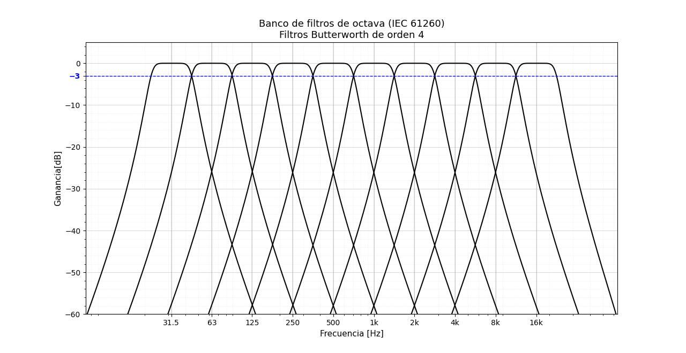
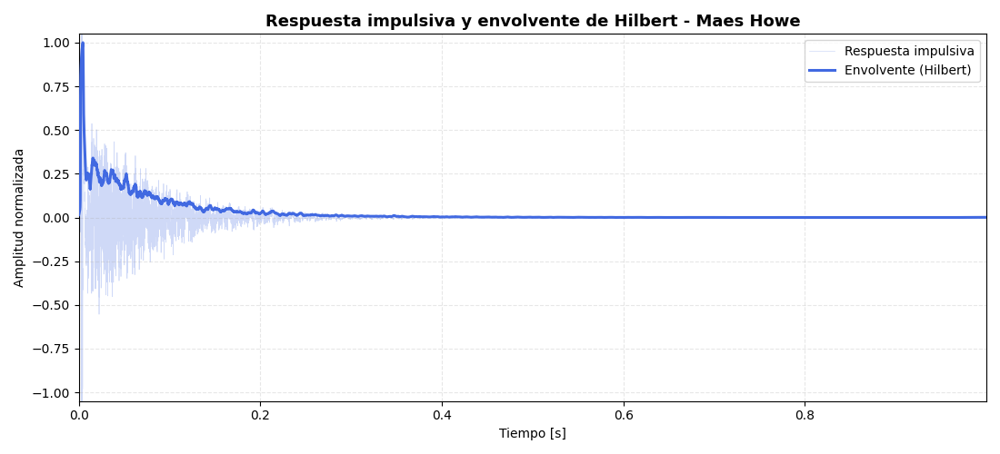
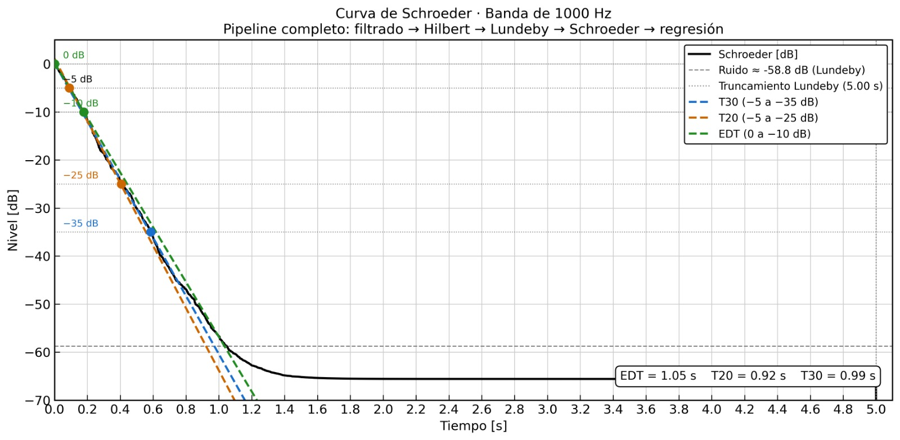

# Desarrollo de un software para el cálculo de parámetros acústicos según la norma ISO 3382-1

---

## Resumen

Este documento presenta el desarrollo de una API RESTful orientada al cálculo de parámetros acústicos según la norma ISO 3382-1. El software diseñado procesa la respuesta al impulso para la obtención de parámetros acústicos por bandas de octava, tanto a través de la generación de un barrido senoidal, y el posterior procesamiento de la respuesta de la sala a través del correspondiente filtro inverso, como de la carga de archivos en formato wav que contienen señales de respuestas impulsivas. Por otra parte se incluye la posibilidad de generar ruido rosa.

**Keywords:** ISO 3382, acústica, respuesta impulsiva (RI), procesamiento digital de señales (DSP)

---

## 1. Introducción 

El análisis acústico de salas basado en la norma ISO 3382-1 [1], permite caracterizar su comportamiento a partir de la respuesta al impulso, considerando el recinto como un sistema lineal e invariante en el tiempo. RIR-API (Room Impulse Response Application Programming Interface), es una biblioteca de software implementada en lenguaje Python que reúne los algoritmos necesarios para la generación de señales de excitación, la obtención y procesamiento de respuestas impulsivas y el cálculo de parámetros acústicos objetivos.

Con el propósito de facilitar la integración del software con aplicaciones externas y desacoplar la lógica de procesamiento de la interfaz de usuario, las funcionalidades de RIR-API se exponen mediante una API RESTful. Esta interfaz permite acceder a los distintos servicios del sistema a través del protocolo HTTP, utilizando recursos y métodos estandarizados para la generación de señales, la carga y procesamiento de respuestas impulsivas y la obtención de resultados en formato JSON.

La combinación de una biblioteca especializada para el procesamiento digital de señales y una arquitectura basada en servicios REST proporciona una solución modular, escalable y reutilizable, permitiendo que el sistema pueda integrarse con interfaces web.

El software desarrollado automatiza el flujo completo de análisis acústico, desde la generación de la señal de excitación hasta la obtención de los principales parámetros definidos en [1], entre ellos EDT,T20 ,T30,D50 y C80, calculados por bandas de octava mediante filtros conformes a la norma IEC 61260-1 [2].

## 2 Objetivos
### 2.1 Generales
Desarrollar una biblioteca en Python para el procesamiento y análisis de señales acústicas, complementada con una API REST que permita acceder a sus funcionalidades de manera organizada, modular y reutilizable, aplicando buenas prácticas de ingeniería de software, validación mediante pruebas automatizadas y documentación técnica.

### 2.2 Particulares
Implementar funciones para la generación, adquisición y procesamiento de señales de audio.
Desarrollar algoritmos de análisis acústico basados en la norma ISO 3382 para la estimación de parámetros de reverberación.
Implementar filtros en bandas de octava y herramientas para el cálculo de la curva de decaimiento energético (EDC).
Exponer las funcionalidades de la biblioteca mediante una API REST utilizando FastAPI.
Verificar el correcto funcionamiento de cada módulo mediante pruebas unitarias y de integración.
Documentar el proyecto y mantener un flujo de desarrollo colaborativo utilizando Git y GitHub.

## 3. Marco teórico

La respuesta al impulso de un recinto (Room Impulse Response, RIR) describe el comportamiento acústico de un ambiente frente a una excitación impulsiva. A partir de ella es posible caracterizar objetivamente las propiedades acústicas del recinto mediante diferentes parámetros normalizados.

Para el análisis de la RIR, la señal se divide en bandas de octava utilizando filtros digitales, permitiendo evaluar el comportamiento en distintas frecuencias. Posteriormente, la envolvente energética de la respuesta se obtiene mediante la transformada de Hilbert y se aplica el método de Lundeby para estimar el punto donde la energía de la señal alcanza el nivel de ruido de fondo, evitando que éste afecte el cálculo de los parámetros.

La energía acumulada se determina mediante la integral de Schroeder, que genera la Energy Decay Curve (EDC). Sobre esta curva se realizan regresiones lineales en distintos intervalos de decaimiento para obtener parámetros como EDT, T10, T20, T30 y T60, representativos del tiempo de reverberación del recinto.

Además de los tiempos de reverberación, la API calcula parámetros relacionados con la inteligibilidad y la claridad del sonido, como D50 y C80, ampliamente utilizados en acústica arquitectónica y definidos por la norma ISO 3382. Estos indicadores permiten evaluar objetivamente la calidad acústica de un espacio a partir de su respuesta al impulso.

## 4. Desarrollo 

### 4.1 Arquitecura

En la figura 1 se observa el esquema del diseño de arquitectura del proyecto.

 

### 4.2 Diseño
La API fue desarrollada siguiendo una arquitectura modular basada en el framework FastAPI, separando claramente las responsabilidades de cada componente para facilitar el mantenimiento, la reutilización del código y la escalabilidad del proyecto.

El usuario interactúa con la aplicación mediante solicitudes HTTP dirigidas a los distintos endpoints. Cada endpoint pertenece a un router, encargado de definir las rutas disponibles y recibir los parámetros enviados por el cliente.

Antes de ejecutar cualquier procesamiento, los datos de entrada y salida son validados mediante schemas implementados con Pydantic. Esto asegura que la información recibida tenga el formato esperado y permite generar respuestas consistentes.

Una vez validados los datos, los routers delegan la lógica de procesamiento a los services, donde se implementan los distintos algoritmos de generación, procesamiento y análisis de señales acústicas. Esta separación permite mantener desacoplada la lógica de negocio de la capa de comunicación HTTP.

Los resultados obtenidos por los servicios son devueltos al router, que construye la respuesta utilizando los schemas correspondientes y la envía nuevamente al cliente en formato JSON.

De esta forma, el flujo general de la aplicación puede resumirse como:

Cliente → Endpoints → Routers → Schemas → Services → Respuesta JSON

Esta organización favorece la claridad del código, simplifica la incorporación de nuevas funcionalidades y facilita el desarrollo colaborativo al mantener cada componente con una responsabilidad específica.

### 4.3 Funciones
#### Generación de señales: 
*Pink noise*: Con el objetivo de disponer de una señal de referencia para ensayos y calibraciones acústicas, la API implementa la generación de ruido rosa. A diferencia del sine sweep, esta señal no se utiliza para obtener la respuesta al impulso ni para el cálculo de los parámetros acústicos, sino que constituye un estándar ampliamente utilizado en mediciones electroacústicas y de audio debido a su distribución espectral de energía.

La función genera una señal de ruido rosa de duración y frecuencia de muestreo configurables, normalizada para facilitar su reproducción y utilización en distintas aplicaciones, como la verificación de sistemas de sonido, pruebas de equipos y mediciones acústicas generales.

*Sine sweep*: Con el objetivo de caracterizar completamente un sistema, la API implementa la generación de un barrido de senoidal logarítmico (sine sweep). Esta función permite configurar la frecuencia inicial, la frecuencia final y la duración del barrido, generando tanto la señal de excitación como su filtro inverso, necesario para su procesamiento posterior para recuperar la respuesta al impulso, a partir de la cual es posible calcular los distintos parámetros acústicos implementados en la API.

#### Reproducción y grabación: 
La función de reproducción y grabación permite reproducir una señal de audio a través del sistema de salida seleccionado mientras registra simultáneamente la respuesta capturada por un dispositivo de entrada. Su objetivo es obtener una grabación sincronizada de la señal emitida para posteriormente analizar la respuesta impulsiva (RIR) del recinto.

Internamente se encarga de configurar los dispositivos de audio, establecer la frecuencia de muestreo, controlar la duración de la adquisición y devolver la señal registrada en un arreglo numérico apto para su procesamiento posterior. Esta función constituye el punto de partida del flujo completo de medición acústica.

#### Cargar audio: 
La función de carga de audio permite importar un archivo de sonido almacenado en disco para incorporarlo al flujo de procesamiento del sistema.

Su propósito es obtener la señal digital y su frecuencia de muestreo, independientemente del origen del archivo, permitiendo trabajar posteriormente con filtros, cálculos energéticos y parámetros acústicos. Además, valida que el archivo exista y que el formato sea compatible con el procesamiento.

#### Sintetizar RI:
Con el objetivo de generar respuestas al impulso artificiales para ensayos y validación de la API, se implementa una función que sintetiza una respuesta al impulso a partir de valores de T60 definidos para distintas bandas de octava. Esto permite disponer de señales con un comportamiento acústico controlado, útiles para verificar el correcto funcionamiento de los algoritmos de análisis.

La función genera ruido blanco, lo filtra en cada banda de octava especificada y aplica una envolvente exponencial de acuerdo con el tiempo de reverberación indicado para cada banda. Finalmente, combina todas las contribuciones y normaliza la respuesta al impulso resultante.

#### Obtener RI desde sweep:
La función de obtención de la respuesta al impulso permite recuperar la caracterización de un sistema a partir de la "deconvolusión" de la grabación de la respuesta del sistema al sine sweep y su filtro inverso, de esta manera elimina el efecto de la señal de excitación. 

Esta respuesta constituye la entrada para las etapas posteriores de procesamiento, permitiendo calcular los parámetros acústicos de acuerdo con la metodología implementada en la API.

#### Filtro de octava:
Con el objetivo de analizar el comportamiento acústico en función de la frecuencia, la API implementa un filtro pasabanda de una octava basado en filtros Butterworth. Esta función permite aislar el contenido de una banda de octava determinada, definida a partir de una frecuencia central configurable, de acuerdo con los límites establecidos por la norma IEC 61260.

A partir de la señal de entrada, diseña y aplica el filtro correspondiente, devolviendo una señal filtrada que puede utilizarse para el cálculo de los distintos parámetros acústicos por banda de frecuencia.

#### Convertir a escala logarítmica: 
La función de conversión a escala logarítmica transforma una señal expresada en escala lineal hacia decibeles (dB), utilizando una escala logarítmica.

Esta conversión resulta indispensable en acústica, ya que la percepción humana del sonido y la mayoría de los parámetros acústicos se expresan en decibeles. Además del cálculo logarítmico, la función contempla el tratamiento de valores cercanos a cero para evitar errores numéricos durante la operación.

#### Suavizar señal:
Con el objetivo de reducir las fluctuaciones producidas por el ruido y facilitar el análisis de la respuesta al impulso, la API implementa una función de suavizado de señales. Esta permite obtener una representación más estable de la envolvente de la señal antes de realizar distintos análisis acústicos.

La función ofrece dos métodos de suavizado configurables: mediante la transformada de Hilbert, que obtiene la envolvente de la señal, o mediante un filtro de media móvil, cuyo tamaño de ventana puede definirse según las necesidades del análisis. La salida conserva la misma longitud que la señal de entrada, permitiendo su utilización en las etapas posteriores del procesamiento.

#### Integral de Schroeder:
Con el objetivo de analizar el decaimiento energético de una respuesta al impulso, la API implementa el cálculo de la integral de Schroeder. Esta función obtiene la Energy Decay Curve (EDC), fundamental para la estimación de los tiempos de reverberación y otros parámetros acústicos definidos por la norma ISO 3382.

A partir de la respuesta al impulso, calcula la energía acumulada desde el final de la señal hacia el comienzo y la normaliza respecto de la energía total, generando una curva de decaimiento energético apta para las etapas posteriores del análisis acústico.

#### Regresión lineal:
La función de regresión lineal calcula la recta que mejor aproxima un conjunto de datos mediante el método de mínimos cuadrados. Dentro del proyecto se utiliza principalmente para estimar los tiempos de reverberación (EDT, T10, T20 y T30) a partir de la curva de decaimiento energético obtenida mediante la integral de Schroeder.

Como resultado devuelve la pendiente, la ordenada al origen y el coeficiente de determinación (R²), el cual permite evaluar la calidad del ajuste realizado.

#### Calcular parámetros acústicos:
La función de cálculo de parámetros acústicos permite obtener los principales indicadores utilizados para caracterizar el comportamiento acústico de un recinto a partir de su respuesta al impulso.

Su propósito es calcular automáticamente los parámetros T10, T20, T30, T60, EDT, C80 y D50. Para ello, utiliza la curva de decaimiento energético obtenida mediante la integral de Schroeder y aplica una regresión lineal sobre los intervalos establecidos por la norma para estimar los distintos tiempos de reverberación. Los parámetros obtenidos constituyen el resultado final del análisis realizado por la API.

#### Método lundeby
La función implementa el método de Lundeby para estimar automáticamente el punto de truncamiento de una respuesta al impulso. A partir de este punto es posible separar el decaimiento útil del ruido de fondo, mejorando la precisión de los cálculos posteriores de la curva de decaimiento energético y de los parámetros acústicos.

#### RIR_API:
La API desarrollada expone mediante servicios HTTP las principales funcionalidades implementadas durante el proyecto, permitiendo ejecutar los algoritmos de procesamiento acústico sin necesidad de acceder directamente al código fuente.

Cada endpoint recibe los parámetros necesarios, ejecuta el procesamiento correspondiente y devuelve los resultados en formato JSON, facilitando la integración con otras aplicaciones o interfaces gráficas.

Entre los servicios disponibles se encuentran operaciones sobre señales, filtros, generación de curvas en escala logarítmica, suavizado, regresión lineal y cálculo de parámetros acústicos.

### 4.4 Tests

#### Generación de señales: 
***Pink noise***: Los tests verifican que la señal generada tenga la duración esperada; el tipo de dato devuelto sea un arreglo de NumPy; la amplitud se encuentre correctamente normalizada entre -1 y 1; y que su contenido espectral presente una pendiente cercana a −3 dB por octava, característica propia del ruido rosa.

***Sine sweep***: Los tests verifican que la función genere correctamente el sine sweep y su filtro inverso; ambas señales tengan la longitud esperada; el barrido cubra el rango de frecuencias especificado; la frecuencia instantánea aumente de forma monótona; la convolución entre el sine sweep y su filtro inverso produzca una aproximación a un impulso; y se manejen correctamente parámetros inválidos, tanto de tipo como de valor.

#### Reproducción y grabación: 
Los tests verifican que la función complete correctamente el proceso de reproducción y grabación; la señal obtenida tenga la longitud esperada; la frecuencia de muestreo utilizada sea la indicada; el tipo de dato devuelto sea el correcto;
la función responda adecuadamente ante parámetros inválidos.

#### Cargar audio: 
Los tests verifican que el archivo pueda abrirse correctamente; la señal cargada tenga dimensiones válidas; la frecuencia de muestreo corresponda con la almacenada en el archivo; se detecten archivos inexistentes; se manejen correctamente errores de lectura.

#### Sintetizar RI:
Los tests verifican que la respuesta al impulso sintetizada tenga la duración esperada; el tipo y las dimensiones de la señal generada sean correctos; y que el decaimiento energético de cada banda de octava reproduzca, con una tolerancia establecida, el T60 especificado para su síntesis.

#### Obtener RI desde sweep:
Los tests verifican que la deconvolución entre la grabación del sine sweep y su filtro inverso permita recuperar correctamente la respuesta al impulso; el pico principal de la respuesta obtenida sea claramente identificable; la respuesta recuperada conserve una alta similitud con una respuesta al impulso sintetizada; y el proceso de obtención de la RI produzca resultados consistentes para su posterior análisis acústico.

#### Filtro de octava:
Los tests verifican que el filtro presente una ganancia cercana a 0 dB en la frecuencia central de la banda; atenúe adecuadamente las componentes ubicadas fuera de la banda de paso; y que la respuesta en frecuencia alcance aproximadamente −3 dB en las frecuencias de corte, de acuerdo con el comportamiento esperado de un filtro Butterworth pasabanda de una octava.

#### Convertir a escala logarítmica: 
Los tests verifican que la conversión produzca los valores esperados; la salida conserve la longitud de la señal original; no aparezcan valores indefinidos (NaN o infinito);
se manejen correctamente señales con energía muy baja o nula.

#### Suavizar señal:
Los tests verifican que el suavizado mediante la transformada de Hilbert genere una envolvente con valores no negativos y conserve la longitud de la señal original. Asimismo, comprueban que el suavizado mediante media móvil mantenga la misma cantidad de muestras que la señal de entrada, garantizando su compatibilidad con las etapas posteriores del procesamiento.

#### Integral de Schroeder:
Los tests verifican que la curva de decaimiento energético conserve la misma longitud que la respuesta al impulso original; presente un comportamiento monótonamente decreciente; reproduzca el decaimiento esperado para una respuesta al impulso sintetizada con un tiempo de reverberación conocido; y se encuentre correctamente normalizada, comenzando en 0 dB.

#### Regresión lineal:
Los tests verifican que la pendiente calculada sea correcta; la ordenada al origen corresponda con los datos utilizados; el coeficiente R² tenga el valor esperado; la función responda correctamente ante conjuntos de datos pequeños;
se detecten correctamente casos degenerados o inválidos.

#### Calcular parámetros acústicos:
Los tests verifican que los parámetros acústicos se calculen correctamente a partir de una respuesta al impulso sintetizada; el valor estimado de T30 sea consistente con el tiempo de reverberación utilizado para generar la señal; el parámetro D50 se encuentre dentro del rango físico esperado; y C80 presente valores coherentes para respuestas al impulso con la energía concentrada al comienzo.

#### Método lundeby
Los tests verifican que la función estime correctamente el punto de truncamiento de una respuesta al impulso; el índice obtenido se encuentre dentro de los límites de la señal; el algoritmo responda correctamente tanto para respuestas con decaimiento exponencial como para señales dominadas por ruido; y los resultados sean estables al procesar señales equivalentes.

#### RIR_API:
Los tests de la API verifican que cada endpoint responda correctamente a solicitudes válidas; los códigos de estado HTTP sean los esperados; las respuestas contengan la estructura JSON correcta; se validen adecuadamente los parámetros recibidos; se gestionen correctamente solicitudes inválidas o incompletas; los resultados devueltos coincidan con los obtenidos por las funciones internas del sistema.
            
## 5. Resultados
### 5.1 Filtros
En la figura 2, se observa el banco de filtros de octava implementado.

### 5.2 Suavizado
En la figura 3, se muestra la aplicación del suavizado de la respuesta impulsiva del recinto Maes Howe [3] aplicando la transformada de Hilbert.

### 5.3 Schroeder y regresión lineal
En la figura 4, se observa el pipeline filtro de octava --> transformada de Hilbert --> método Lundeby --> integración de Schroeder --> regresión lineal, para la respuesta al impulso de la sala Eleveden Hall [4], aplicando el filtro de banda de octava centrado en fo = 1.00 KHz.

##  6 Validación
Se realizó la validación de los parámetros EDT, T10, T20, T30, D50, y C80. 
### 6.1 Procedimiento
Se utilizaron dos respuestas al impulso:
1) Una señal sintetizada.

    Se aplicó la eñal diseñada en la RIR API descrita en el ítem 4.3.

2) La correspondiente al recinto Maes Hawe [3].

    Para obtener la respuesta impulsiva se ha empleado como señal de excitación un barrido senoidal. Se ha usado el micrófono Soundfield SPS422B. La señal de tensión obtenida se encuentra en formato B, y  luego de procesarla, se obtuvo una señal estéreo [5]

Ambas se procesaron en tres programas diferentes: 1)   RIR API diseñada por el grupo 1, 2) RIR API diseñada por la cátedra [6], 3) Room EQ Wizard Room Acoustics Software (REW)[7]. Se obtuvieron los resultados asociados a los parámetros mencionados para las frecuencias centrales de octava de 125 , 250, 500, 1000, 2000, y 4000 Hz.

Luego se realizó la  comparación de los resultados obtenidos, y se obtuvo la precisión para cada uno los parámetros mencionados.

### 6.2 Limitaciones
1) El software REW no otorga los valores vinculados al parámetro T10, mientras que la API de la cátedra no entrega los valores de los parámetros D50 y C80. Debido a ello, la validación de dichos parámetros se realizó solamente con uno de los software descritos.

### 6.3 Resultados
1) Respuesta al impulso sintetizada.

    En las figuras   , se muestran los resultados derivados del procesamiento de la señal sintetizada en cada uno de los programas mencionados.

2) Respuesta al impulso del recinto Maes Hawe.

    En las figuras   , se muestran los resultados derivados del procesamiento de la respuesta impulsiva en cada uno de los programas mencionados.

    Debido a las características de la respuesta impulsiva
    los valores de EDT no han podido determinarse de manera consistente. Por este motivo, para dicho parámetro, se muestran las señales de ambos canales procesados en el software REW.

### 6.4 Análisis

## 7. Conclusiones
Se ha desarrollado el software RIR-API en lenguaje python capaz de generar la señal de excitación, registrar la respuesta del recinto, procesarla y otorgar los parámetros acústicos EDT, T20, T30, D50 y C80 por bandas de octava cumpliendo con las recomendaciones dadas en las normas ISO 3381-1 e IEC 60621-1.

## 8. Adversidades, confesiones y desafíos

### 8.1 Adversidades
El escaso o nulo conocimiento previo tanto del lenguaje de programación utilizado como de los sistemas asociados configuraron la mayor proporción de tiempo destinado al desarrollo del proyecto, restando una pequeña parte para el cumplimiento de los objetivos técnicos vinculados al análisis conceptual del procesamiento de señales.
        
### 8.2 Confesiones
Debido a las razones expuestas en 7.1, se ha recurrido sistemáticamente al vivecoding. 

### 8.3 Desafíos
Comprender en profundidad y adquirir agilidad en la implementación de las buenas prácticas vinculadas a la programación y al procesamiento digital de señales.

## Referencias

[1] ISO 3382-1:2009: Acoustics — Measurement of room acoustic       parametersPart 1: Spaces for music, speech and communication. (2009)

[2] IEC 60621-1:2014: Electroacoustics – Octave-band and fractional-octave-band filters –Part 1: Specifications. (2014)

[3] https://www.openair.hosted.york.ac.uk/?page_id=602

[4] https://www.openair.hosted.york.ac.uk/?s=Elveden+Hall

[5] https://webfiles.york.ac.uk/OPENAIR/IRs/maes-howe/Read%20Me.txt

[6] https://rir-api-frontend.onrender.com/

[7] https://www.roomeqwizard.com/

[3] Fariña, A. . Simultaneous measurement of impulse response and distortion with a swept-sine technique. 108th AES Convention.(2000).